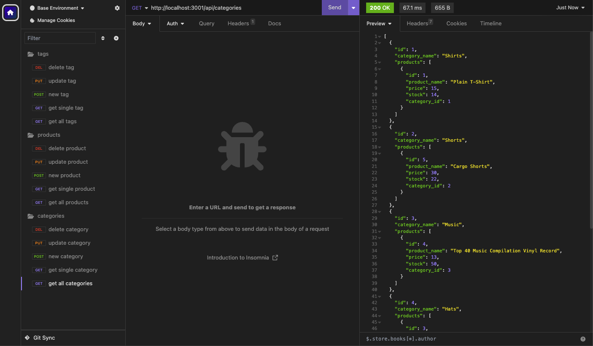
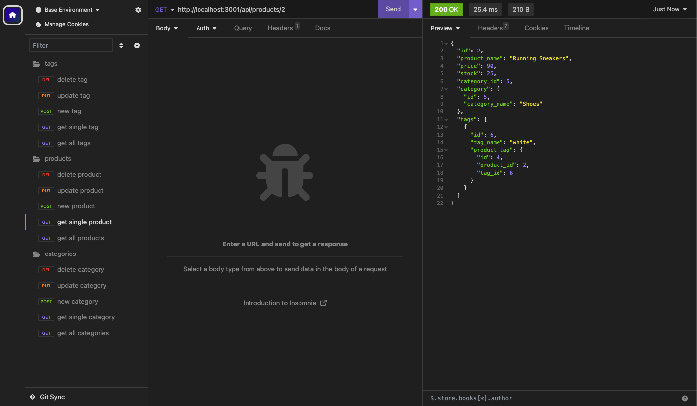
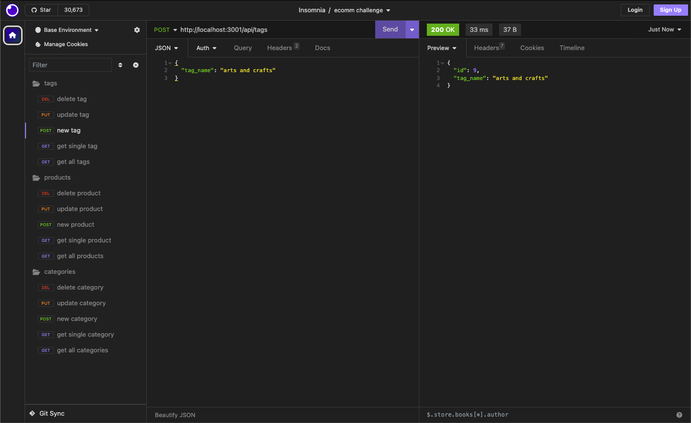

# Sequelize Ecommerce Database

## Description

This application utilizes Express.js and Sequelize to manage an Ecommerce database. This application can be used to easily view, create, update and delete retail items stored in the MySQL database.

This application integrates the server functionality with the database, requiring understanding of how these two entities interact. Sequelize serves as the Object Relational Mapper (ORM) making it easier for developers and users to interact with the MySQL database.

Creating this application gave me a deeper understanding of how the server works and how express and sequelize work together to enhance the experience of working with a database while writing in JavaScript. Being able to think of the database tables and the records inside the tables as objects, thanks to sequelize, streamlines the work flow; allowing the developer to write in almost entirely one language(JavaScript in this case). I hope to work more with sequelize and scale up my ability to access and manipulate the data stored in databases.

## Installation

What are the steps required to install your project? Provide a step-by-step description of how to get the development environment running.

To run this application, first download the [repository](https://github.com/sillytsundere/sequelize-e-comm-db) and open in your preferred code editor. Run `npm install` to download the necessary npm package dependencies:

- [MySQL](https://www.npmjs.com/package/mysql) npm package connects to the MySQL database and performs queries

- [Express.js](https://expressjs.com/) Node.js framework providing many features for web applications

- [Sequelize](https://sequelize.org/) Node.js Object Relational Mapper that connects to a database and performs operations without having to write raw SQL queries

- [dotenv](https://www.npmjs.com/package/dotenv) npm package that loads environment variables from a .env file, keeping secure information out of the code

Before entering your MySQL shell you will need to create your own dotenv file with the following information:

    DB_NAME: 'ecommerce_db'
    DB_USER: '(your MySQL username)'
    DB_PASSWORD: '(your MySQL password)'

This is necessary to be able to connect to the database while also keeping your private information separate from the code.

In your MySQL shell create the database locally by running `source schema.sql` this will also initiate use of the database as the schema.sql file also contains the code to docus on the correct database; `USE (database)_db`.

After closing the MySQL shell, navigate to the main repository in the command line and run `npm run seed` to seed the database and then run `npm run start` to initialize the application.

## Usage

While this application "can" be viewed in a browser, it will be displayed on the webpage (at http://localhost:3001/api/categories categories can be interchanged with products or tags) it will display in JSON format as this application has no front end. Opening the application in Insomnia, at the same http://localhost:3001 link will allow you to access all the different paths and to view the information in a more reader-friendly way.

In Insomnia utilize the main link, http://localhost:3001 with the paths:

- /api/categories

- /api/products

- /api/tags

This will allow you to view and interact with the information in the database.

A video demonstrating the utility of the application can be viewed at this link: https://drive.google.com/file/d/1pNnaCd6NupcfSzUnEy_5VI8FEIct7fVc/view

## Credits

Source code was obtained from [The Coding Bootcamp](https://github.com/coding-boot-camp/fantastic-umbrella)

Badges sourced from: [Awesome Badges](https://dev.to/envoy_/150-badges-for-github-pnk)

## License

## Badges

## How to Contribute

If you have any questions or would like to contribute please contact me at [my Github page](https://github.com/sillytsundere).
